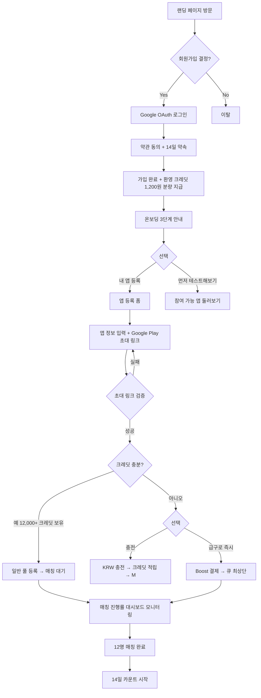
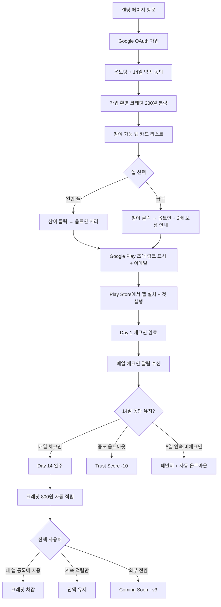
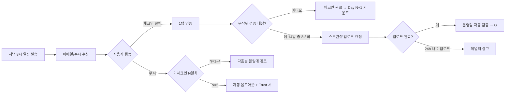
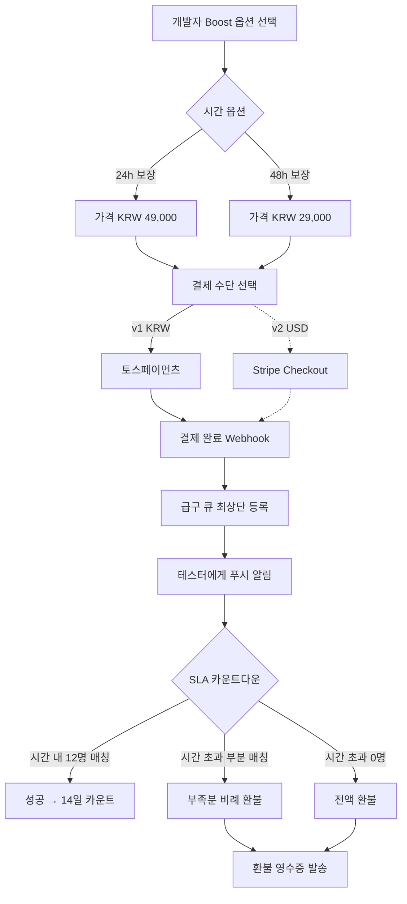
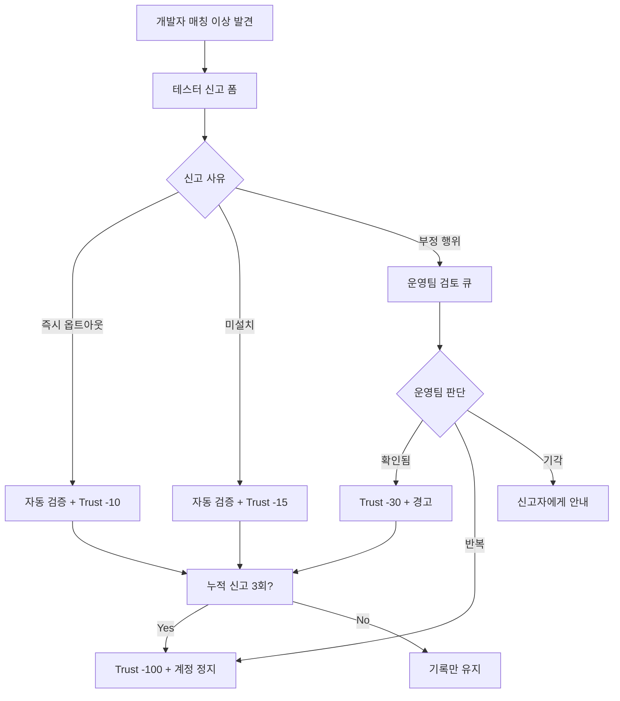
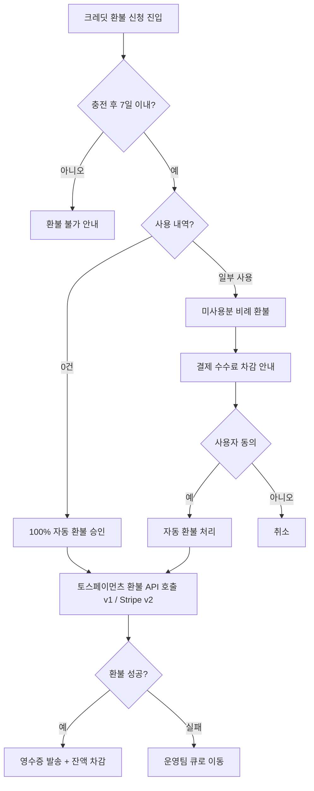
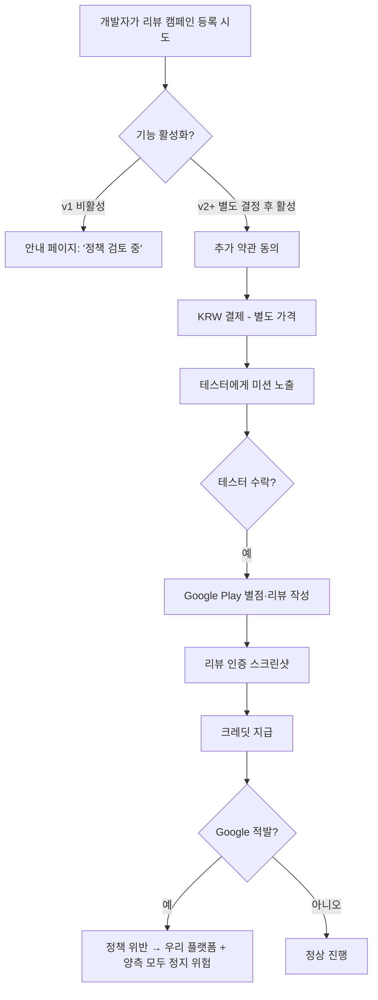

# 사용자 여정도 (User Flow) — Tester Match v1

> 작성일: 2026-05-04 / Version: v0.1
> 본 문서는 **핵심 사용자 흐름**을 Mermaid 다이어그램으로 정의한다.
> 노션 import 시 Mermaid 블록은 자동 렌더링됨.

---

## 1. 신규 가입 → 첫 매칭까지 (개발자)



---

## 2. 신규 가입 → 첫 적립까지 (테스터)



---

## 3. 14일 체크인 일일 흐름



---

## 4. 매칭 알고리즘 흐름

```mermaid
flowchart TD
    A[테스터가 /testing/discover 접근] --> B[큐에서 후보 앱 조회]
    B --> C[필터 적용 - 디바이스/카테고리/언어]
    C --> D[순위 계산]
    D --> E[큐 진입시각 가중치 0.5]
    D --> F[개발자 Trust Score 0.2]
    D --> G[테스터 활성도 0.2]
    D --> H[카테고리 일치 0.1]
    E --> I[정렬]
    F --> I
    G --> I
    H --> I
    I --> J[상위 10건 카드 노출]
    J --> K{테스터 참여 클릭}
    K --> L[Match 레코드 생성]
    L --> M[개발자에게 알림]
    L --> N[테스터에게 초대 링크 전달]
    M --> O[14일 카운트 시작]
    N --> O
```



---

## 5. Boost 결제 + SLA 흐름



---

## 6. 신고 → Trust Score 흐름



---

## 7. 환불 신청 흐름



---

## 8. ⚠️ 보류 흐름 — 리뷰 캠페인 (Critical Risk)



> ❌ 이 흐름은 v1에서 **비활성** 상태로 유지. 흐름 정의만 사전 보유.

---

## 9. 권한·세션 흐름 (보안)

```mermaid
flowchart TD
    A[페이지 진입] --> B{세션 쿠키?}
    B -->|없음| C{Public 페이지?}
    C -->|예| D[정상 노출]
    C -->|아니오| E[/login 리다이렉트]
    B -->|있음| F{토큰 유효?}
    F -->|만료| G[Refresh 시도]
    G -->|성공| H[새 토큰 저장 → 진입]
    G -->|실패| E
    F -->|유효| I{Admin 페이지?}
    I -->|아니오| H
    I -->|예| J{Admin 권한?}
    J -->|예| H
    J -->|아니오| K[403 Forbidden]
```

---

## 10. 흐름 우선순위 (개발 순서)

| Phase | 흐름 |
|---|---|
| Phase 1 | 1. 가입 → 첫 매칭 (개발자) |
| Phase 1 | 2. 가입 → 첫 적립 (테스터) |
| Phase 2 | 3. 14일 체크인 |
| Phase 2 | 4. 매칭 알고리즘 |
| Phase 3 | 5. Boost 결제 + SLA |
| Phase 3 | 7. 환불 신청 |
| Phase 4 | 6. 신고 → Trust Score |
| Phase 4 | 9. 권한·세션 |
| **보류** | 8. 리뷰 캠페인 |
