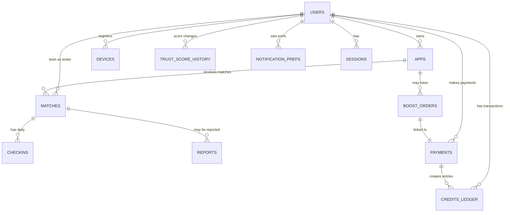

# ERD (Entity Relationship Diagram) — Tester Match v1

> 작성일: 2026-05-04 / Version: v0.1
> DB: PostgreSQL 15+ (Supabase 또는 Neon)

---

## 1. 전체 구조 다이어그램



---

## 2. 테이블 명세

### 2.1 `users` (사용자)

| 컬럼 | 타입 | 제약 | 설명 |
|---|---|---|---|
| id | bigint | PK, identity | |
| email | citext | UNIQUE, NOT NULL | Google OAuth 이메일 |
| google_id | text | UNIQUE | OAuth provider id |
| nickname | text | NOT NULL | 화면 표시명 |
| timezone | text | DEFAULT 'Asia/Seoul' | IANA tz |
| country | char(2) | | ISO-3166-1 alpha-2 |
| trust_score | int | DEFAULT 50, CHECK 0-100 | 평판 점수 |
| role | text | DEFAULT 'user' | 'user' / 'admin' |
| status | text | DEFAULT 'active' | 'active' / 'suspended' / 'withdrawn' |
| terms_agreed_at | timestamptz | NOT NULL | |
| privacy_agreed_at | timestamptz | NOT NULL | |
| created_at | timestamptz | DEFAULT now() | |
| updated_at | timestamptz | DEFAULT now() | |
| deleted_at | timestamptz | NULL | 회원 탈퇴 시 (soft delete) |

**인덱스**: `email`, `google_id`, `(status, trust_score DESC)`

---

### 2.2 `devices` (등록 디바이스)

| 컬럼 | 타입 | 제약 | 설명 |
|---|---|---|---|
| id | bigint | PK | |
| user_id | bigint | FK → users(id) | |
| device_fingerprint | text | UNIQUE | Play Integrity 결과 해시 |
| model | text | | |
| os_version | text | | |
| is_primary | boolean | DEFAULT true | |
| created_at | timestamptz | DEFAULT now() | |

**제약**: 1 user 당 최대 2개 (앱 레벨 검증), `device_fingerprint`는 전역 UNIQUE → fake account 방지

---

### 2.3 `apps` (등록 앱)

| 컬럼 | 타입 | 제약 | 설명 |
|---|---|---|---|
| id | bigint | PK | |
| owner_user_id | bigint | FK → users(id) | |
| name | text | NOT NULL | 앱 이름 |
| category | text | NOT NULL | enum: game/utility/social/... |
| short_description | text | NOT NULL, CHECK len ≤ 140 | |
| store_invite_url | text | NOT NULL | Google Play 초대 링크 |
| store_invite_url_validated_at | timestamptz | | HEAD 검증 시각 |
| required_testers | int | DEFAULT 12 | 필요 테스터 수 |
| status | text | DEFAULT 'draft' | 'draft' / 'matching' / 'completed' / 'paused' / 'deleted' |
| is_boost | boolean | DEFAULT false | 급구 여부 |
| boost_deadline_at | timestamptz | NULL | SLA 마감 |
| created_at | timestamptz | DEFAULT now() | |
| updated_at | timestamptz | DEFAULT now() | |

**인덱스**: `(status, created_at)`, `owner_user_id`, `is_boost WHERE status='matching'`

---

### 2.4 `matches` (매칭)

| 컬럼 | 타입 | 제약 | 설명 |
|---|---|---|---|
| id | bigint | PK | |
| app_id | bigint | FK → apps(id) | |
| tester_user_id | bigint | FK → users(id) | |
| matched_at | timestamptz | DEFAULT now() | 매칭 성사 |
| opted_in_at | timestamptz | NULL | 테스터 옵트인 |
| opted_out_at | timestamptz | NULL | 옵트아웃 |
| opt_out_reason | text | NULL | 사유 |
| status | text | DEFAULT 'pending' | 'pending' / 'active' / 'completed' / 'opted_out' / 'penalized' |
| day_count | int | DEFAULT 0 | 현재 진행 일수 (0~14) |
| credit_payout | int | DEFAULT 800 | 완주 시 지급 크레딧 |
| created_at | timestamptz | DEFAULT now() | |

**인덱스**: `(app_id, status)`, `(tester_user_id, status)`, `(status, opted_in_at)` for 14일 추적
**제약**: 동일 (app_id, tester_user_id) 활성 매칭은 1개만

---

### 2.5 `checkins` (일일 체크인)

| 컬럼 | 타입 | 제약 | 설명 |
|---|---|---|---|
| id | bigint | PK | |
| match_id | bigint | FK → matches(id) | |
| day_n | int | NOT NULL CHECK 1-14 | 며칠차 |
| checked_in_at | timestamptz | DEFAULT now() | |
| screenshot_url | text | NULL | 무작위 검증 시 |
| screenshot_verified | boolean | NULL | NULL=대기, true/false |
| verified_at | timestamptz | NULL | |
| verified_by | bigint | FK → users(id) NULL | 운영자 |

**인덱스**: `(match_id, day_n) UNIQUE`

---

### 2.6 `credits_ledger` (크레딧 원장 — append-only)

| 컬럼 | 타입 | 제약 | 설명 |
|---|---|---|---|
| id | bigint | PK | |
| user_id | bigint | FK → users(id) | |
| amount | int | NOT NULL | 양수=증가, 음수=차감 |
| balance_after | int | NOT NULL | 기록 시점 잔액 |
| type | text | NOT NULL | 'welcome'/'earn'/'charge'/'spend'/'refund'/'penalty'/'adjust'/'expire' |
| ref_type | text | | 'match'/'payment'/'app'/etc |
| ref_id | bigint | | 참조 ID |
| description | text | | 설명 |
| created_at | timestamptz | DEFAULT now() | |

**원칙**: append-only (수정·삭제 금지). 잔액 = `SUM(amount) WHERE user_id=?`로 검증 가능
**인덱스**: `(user_id, created_at DESC)`, `type`

---

### 2.7 `payments` (결제)

| 컬럼 | 타입 | 제약 | 설명 |
|---|---|---|---|
| id | bigint | PK | |
| user_id | bigint | FK → users(id) | |
| provider | text | NOT NULL | 'toss' / 'stripe' |
| provider_tx_id | text | UNIQUE NOT NULL | 외부 PG 거래 ID |
| amount_krw | int | NOT NULL | 원화 환산 금액 |
| amount_original | numeric(12,2) | | 외화 원본 |
| currency | char(3) | DEFAULT 'KRW' | |
| purpose | text | NOT NULL | 'charge' / 'boost' |
| ref_app_id | bigint | FK → apps(id) NULL | Boost 시 |
| status | text | DEFAULT 'pending' | 'pending'/'completed'/'failed'/'refunded'/'partially_refunded' |
| refunded_amount | int | DEFAULT 0 | |
| paid_at | timestamptz | NULL | |
| refunded_at | timestamptz | NULL | |
| created_at | timestamptz | DEFAULT now() | |

**인덱스**: `(user_id, created_at DESC)`, `provider_tx_id`

---

### 2.8 `boost_orders` (Boost 주문 + SLA)

| 컬럼 | 타입 | 제약 | 설명 |
|---|---|---|---|
| id | bigint | PK | |
| app_id | bigint | FK → apps(id) | |
| payment_id | bigint | FK → payments(id) | |
| sla_hours | int | NOT NULL | 24 또는 48 |
| sla_deadline_at | timestamptz | NOT NULL | |
| sla_status | text | DEFAULT 'in_progress' | 'in_progress'/'fulfilled'/'partial'/'failed' |
| matched_count | int | DEFAULT 0 | SLA 마감 시 매칭 수 |
| refund_amount | int | DEFAULT 0 | SLA 미달 환불액 |
| created_at | timestamptz | DEFAULT now() | |

---

### 2.9 `reports` (신고)

| 컬럼 | 타입 | 제약 | 설명 |
|---|---|---|---|
| id | bigint | PK | |
| reporter_user_id | bigint | FK → users(id) | |
| reported_user_id | bigint | FK → users(id) | |
| match_id | bigint | FK → matches(id) NULL | |
| reason | text | NOT NULL | enum |
| description | text | | 자유 입력 |
| status | text | DEFAULT 'pending' | 'pending'/'reviewing'/'upheld'/'dismissed' |
| reviewed_by | bigint | FK → users(id) NULL | |
| reviewed_at | timestamptz | NULL | |
| created_at | timestamptz | DEFAULT now() | |

---

### 2.10 `trust_score_history` (Trust Score 변동)

| 컬럼 | 타입 | 제약 | 설명 |
|---|---|---|---|
| id | bigint | PK | |
| user_id | bigint | FK → users(id) | |
| delta | int | NOT NULL | +/- |
| score_after | int | NOT NULL | |
| reason | text | NOT NULL | enum |
| ref_type | text | NULL | 'match'/'report'/etc |
| ref_id | bigint | NULL | |
| created_at | timestamptz | DEFAULT now() | |

---

### 2.11 `notification_prefs` (알림 설정)

| 컬럼 | 타입 | 제약 | 설명 |
|---|---|---|---|
| user_id | bigint | PK, FK → users(id) | |
| email_enabled | boolean | DEFAULT true | |
| discord_webhook_url | text | NULL | |
| slack_webhook_url | text | NULL | |
| daily_checkin_hour | int | DEFAULT 20 | 0~23 |
| categories | jsonb | | 알림 종류별 ON/OFF |
| updated_at | timestamptz | DEFAULT now() | |

---

### 2.12 `sessions` (세션 — NextAuth가 관리)

NextAuth의 기본 스키마를 따름 (id, user_id, expires_at, session_token).

---

### 2.13 `audit_logs` (감사 로그)

| 컬럼 | 타입 | 제약 | 설명 |
|---|---|---|---|
| id | bigint | PK | |
| actor_user_id | bigint | FK → users(id) NULL | 운영자/사용자 |
| action | text | NOT NULL | 'user.suspend' 등 |
| target_type | text | | 'user'/'app'/'payment' |
| target_id | bigint | | |
| metadata | jsonb | | |
| ip | inet | | |
| user_agent | text | | |
| created_at | timestamptz | DEFAULT now() | |

> 운영자 행위(정지/환불/조정)는 모두 기록. 보관 5년.

---

## 3. 핵심 쿼리 패턴 (참고)

### 3.1 사용자 잔액 조회
```sql
SELECT COALESCE(SUM(amount), 0) AS balance
FROM credits_ledger
WHERE user_id = $1;
```

### 3.2 14일 진행 중 매칭 조회 (개발자 화면)
```sql
SELECT m.*, u.nickname AS tester_nickname,
       EXTRACT(DAY FROM (now() - m.opted_in_at)) AS day_n
FROM matches m
JOIN users u ON u.id = m.tester_user_id
WHERE m.app_id = $1
  AND m.status = 'active'
ORDER BY m.opted_in_at;
```

### 3.3 매칭 후보 앱 검색 (테스터 화면)
```sql
SELECT a.*, u.trust_score AS dev_trust,
       (CASE WHEN a.is_boost THEN 1000 ELSE 0 END
        + (now()::date - a.created_at::date) * 10
        + u.trust_score * 2) AS rank_score
FROM apps a
JOIN users u ON u.id = a.owner_user_id
WHERE a.status = 'matching'
  AND NOT EXISTS (
    SELECT 1 FROM matches m
    WHERE m.app_id = a.id AND m.tester_user_id = $1
  )
ORDER BY rank_score DESC
LIMIT 10;
```

---

## 4. 마이그레이션 / 시드 권장사항

- **마이그레이션 도구**: Drizzle ORM, Prisma, 또는 raw SQL + Supabase CLI
- **시드 데이터**: 카테고리 마스터, 운영자 1계정, 테스트용 더미 사용자 5명
- **백업**: Supabase는 일 1회 자동 백업 (Pro), 30일 보관
- **PII 마스킹**: 분석/CS용 복제본은 이메일·IP 해시 처리

---

## 5. 향후 확장 (v2/v3)

| 신규 테이블 | 용도 | 시점 |
|---|---|---|
| `boards`, `posts`, `comments` | 게시판 | v2 |
| `external_pay_partners`, `exchange_orders` | 외부 포인트 전환 | v3 |
| `referrals` | 친구 초대 | v2 |
| `service_listings`, `service_orders` | 부가 서비스 마켓 | v3 |
